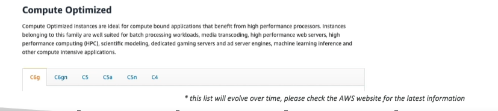
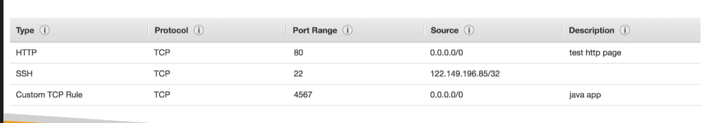
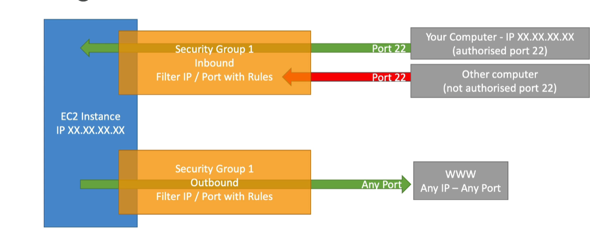
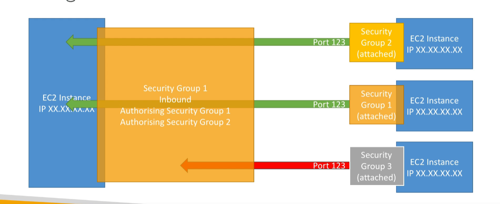
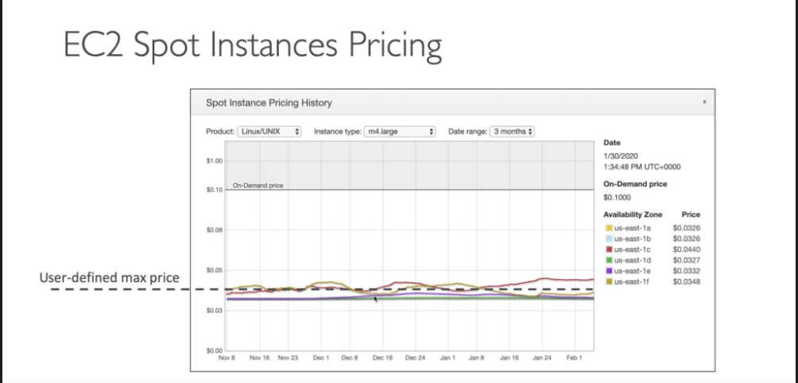

# EC2 Fundamentals

### EC2 Basics
- EC2 is one of the most popular of AWS offering
- EC2: Elastic Compute Cloud = Infrastructure as a Service
- It mainly consists in the capability of:
  + Renting virtual machines (EC2)
  + Storing data on virtual drives (EBS)
  + Distributing load accross machines (ELB)
  + Scaling the services using an auto-scaling group (ASG)

- Knowing EC2 is fundamental to understand how the Cloud works

### EC2 Instance Types Basics

#### EC2 Instance Types - Overview
- You can use different types of EC2 instances that are optimised for different use cases (check out instances type in Amazon)
- AWS has the following naming convention: m5.2xlarge 
  + m: instance class
  + 5: generation (AWS improves them over time. next time it will be m6)
  + 2xlarge: size within the instance class (the more the size, the larger in size it will be)

  #### EC2 Instance types - General Purpose
  - Great for a diversity of workloads such as web servers or code repositories 
  - Balance between: 
    + Compute
    + Memory
    + Networking 
  - In the course, we will be using t2.mico which is a General Purpose EC2 instance
    
  
#### EC2 Instance Types - Compute Optimized (Instances start with C. C: Compute)
- Great for compute-intensive tasks that require high performance processors:
 + Batch processing workloads
 + Media transcoding
 + High performance web servers
 + High performance computing (HPC)
 + Scientific modeling & machine learning
 + Dedicated gaming servers

  
   
#### Instance Types - Memory Optimized (Instances start with R. R: Ram)
- Fast performance for workloads that process large data sets in memory 
- Use cases:
  + High performance, relational/non-relational databases
  + Ditributes web scale cache stores
  + In-memory databases optimized for BI (business intelligence)
  + Applications performing real-time processing of big unstructured data

  

#### EC2 Instance Types - Storage Optimized (Instances start with I or D)
- Great for storage-intensive tasks that require high, sequential read and write access to large sets on local storage
- Use cases:
  + High frequency online trancsaction processing (OLTP) systems
  + Relational & NoSQL databases
  + Cache for in-memory databases (for example, Redis)
  + Data warehousing applications
  + Distributed file systems

  

#### EC2 Instance Types: example comparison


  

  -> ec2instances.info (to see the ec2 instances comparison in full)

### Security Groups
- Security Groups are fundamental of network security in AWS
- They control how traffic is allowed into or out of our EC2 Instances
- Security groups only contain allow rules
- Security groups rules can reference by IP or by security group


  
### Security Groups Deeper Dive
- Security groups are acting as a "firewall" on EC2 instances
- They regulate:
    + Access to ports
    + Authorised IP ranges - IPv4 and IPv6
    + Control of inbound network (from other to the instance)
    + Control of outbound network (from the instance to other)

  

  
    
  ### Security Groups - Good to know
  - Can be attached to multiple instances
  - Locked down to a region / VPC combination (if change region, has to set up security group again)
  - Does live "outside" the EC2 - if traffic is blocked the EC2 instance won't see it
  - It's good to maintain one seperate security group for SSH access
  - If your application is not accessible (time out), then it's a security group issue
  - If your application gives "connection refused" error, then it's an application error or it's not launched.
  - All inbound traffic is blocked by default
  - All outbound traffic is authorised by default

   

   ### Classic Ports to know
   - 22 = SSH (Secure Shell) - log into a Linux instance
   - 21 = FTP (File Transfer Protocol) - upload files into a file share
   - 22 = SFTP (Secure File Trasnfer Protocol) - upload files using SSH 
   - 80 = HTTP - access unsecured websites
   - 443 = HTTPS - access secured websites
   - 3389 = RDP (Remote Desktop Protocol) - log into a Window instance

   ### SSH Summary Table

      

1. Connect SSH with command lines
    

   - Allows you to controll remote machine, all using the command line. 

  - To install, open terminal and:
   ```sh
   ssh -i .\project_name.pem ec2-user@Public_IPv4_address 
   ```
  
2. Connect SSH with EC2 instances (using cli interfact inside aws)

- Attach IAM roles for the intances ( IAMReadOnly), rather than do configuration by yourself (another user can steal it, s for security reasons). We assign IAM roles (IAMReadOnlyAccess) to the Instances, now aws cli , do ```aws iam list-users```, we will get access to the user

### EC2 Instances Purchasing Options
- On-demands Instances - short workload, predictable pricing, pay by second
- Reserved ( 1 & 3 years)
  + Reserved Instances - long workloads
  + Convertible Reserved Instances - long workloads with flexible instances
- Saving plans (1 & 3 years) - commitment to an amount of usage, long workload
- Spot Instances - short workloads, cheap, can lose instances (less reliable)
- Dedicated Hosts - book an entire physica server, control instance placement
- Dedicated Instances - no other customers will share your hardware
- Capacity Reservations - reserve capacity in a specific AZ for any durations

<table>
  <tr>
    <th>On-demands Instances</th>
    <td>Short workload, predictable pricing, pay by second</td>
  </tr>
  <tr>
    <th>Saving plans</th>
    <td>Commitment to an amount of usage, long workload</td>
  </tr>
    <tr>
    <th>Spot Instances</th>
    <td>short workloads, cheap, can lose instances (less reliable)</td>
  </tr>
   <tr>
    <th>Dedicated Hosts</th>
    <td>book an entire physica server, control instance placement</td>
  </tr>
   <tr>
    <th> Dedicated Instances</th>
    <td> no other customers will share your hardware</td>
  </tr>
    <tr>
    <th> Capacity Reservations</th>
    <td> reserve capacity in a specific AZ for any durations</td>
  </tr>
</table>

#### EC2 On Demand
- Pay for what you use:
  + Linux or Windows - billing per second, after the first minute
  + All other operating systems - billing per hour

- Has the highest cost but no upfront payment 
- No long-term commitment

- Recommended for **short-term** and **un-interrupted workloads**, where you can't predict how the application will behave

### EC2 Reserved Instances
- Up to 72% discount compared to On-demand
- You reserve a specific instance attributes (Instance Type, Region, Tenancy, OS)
- Reservation Period - 1 year (+discount) or 3 years (+++discount)
- Payment Options - No Upfront (+), Partial Upfront(++), All Upfront (+++)
- Reserved Instance's Scope - Regional or Zonal (reserve capacity in an AZ)
- Recommended for steady-state usage applications (think database)
- You can buy and sell in the Reserved Instance Marketplace

- Convertible Reserved Instance
  + Can change the EC2 instance type, instance family, OS, scope and tenancy
  + Up to 66% discount


### EC2 Saving Plans
- Get a discount based on long-term usage (up to 72% - same as RIs)
- Commit to a certain type of usage ($10/hour for 1 or 3 years)
- Usage beyond EC2 savings plans is billed at the On-Demand Price
- Locked to a specific instance family & AWS region (e.g M5 in us-east-I)
- Flexbile across:
  + Instance Size (e.g, m5.xlarge, m5.2xlarge)
  + OS (e.g Linux, Windows)
  + Tenancy (Host, Dedicated, Default)

### EC2 Spot Instances

- Can get a discount of up to 90% compared to On-demand
- Instances that you can "lose" at any point of time if your max price is less than the current spot price
- The Most cost-efficient instances in AWS
- Useful for workloads that are resilient to failure:
  + Batch jobs 
  + Data analysis
  + Any distributed workloads
  + Workloads with a flexible start and end time

- **Not suitable for critical jobs or databases**

#### EC2 Dedicated Hosts
- A physical server with EC2 instance capacity fully dedicated to your use
- Allows you address compliance requirements and use your existing server-bound software licenses (per-socket, per-core, pe-VM software licenses)
- Purchasing Options:
  + On-demand - pay per second for active Dedicated Host
  + Reserved - 1 or 3 years
- The most expensive option 
- Useful for software that have complicated licensing model (BYO: - Bring Your Own License)
- Or for companies that have strong regulatory or compliance needs

#### EC2 Dedicated Instances

- Instances run on hardware that's dedicated to you
- May share hardware with other instances in same account
- No control over instance placement (can move hardware after Stop/Start)


#### EC2 Capacity Reservations

- Reserve On-Demand instances capacity in a specific AZ for any duration
- You always have access to EC2 capacity when you need it
- **No time commitment** (create/cancel anytime), no billing discounts
- Combine with Regional Reserved Instances and Saving Plans to benefit from billing discounts
- You're charged at On-Demand rate whether you run instances or not
**Suitable for short-term, uninterrupted  workloads that needs to be in a specific AZ**

### Which options - EC2 pricing options


### EC2 Spot Instance Requests (note: AWS won't be supported after December 31 2022. But it might appear in the exam)

- Can get discount of up to 90% compared to On-demand
- Define max spot price and get the instance while current spot price < max
  + The hourly spot price varies based on offer and capacity
  + If the current spot price > your max price, you can choose to **stop** or **terminate** your instance with a 2minute grace period
- Other strategy: Spot Block
 + "block" spot instance during a specified time frame (1 to 6 hours) without interruptions
- **Used for batched jobs, data analysis, or workloads that are resilient to failures** 
- Not great for critical jobs or databases :(




### Terminate Spot Instances


### Spot Fleets
- Spot Fleets = set of Spot Instances = (optional) On-Demand Instances
- The Spot Fleet will try to meet the target capacity with price constraints
  + Define possible launch pools: instance type (m5.large, OS, Availabilty Zone)
  + Can have multiple launch pools, so that the fleet can choose
  + Spot Fleet stops launching instances when reaching capacity or max cost
- Strategies to allocate Spot Instances:
  + lowestPrice: from the pool with the lowest price (cost optimization, short workload)
  + diversified: distributed across all pools (great for availability, long workloads)
  + capacityOptimized: pool with the optimal capacity for the number of instances

  **Spot Fleets allows us to automatically request Spot Instances with the lowest price**

#### Difference Spot Fleets vs Block Instance

| Block Instance | Second Header |
| ------------- | ------------- |
| you place a bid for a specific instance type in one specific AZ and hope you get it |You can request a variety of different instance types that meet your requirements |
