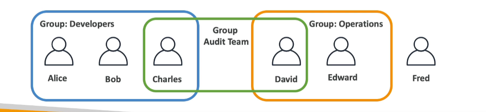
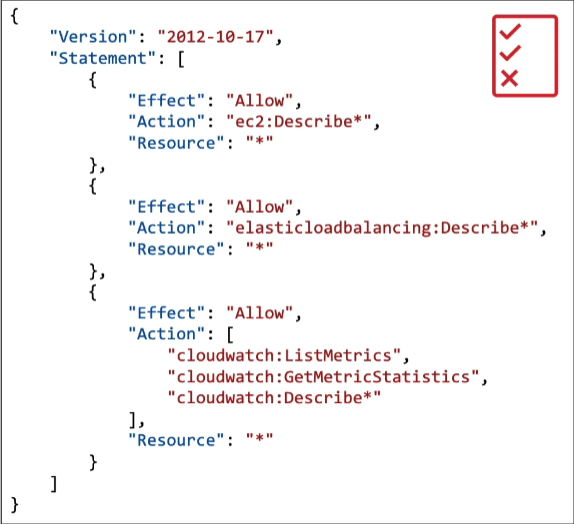
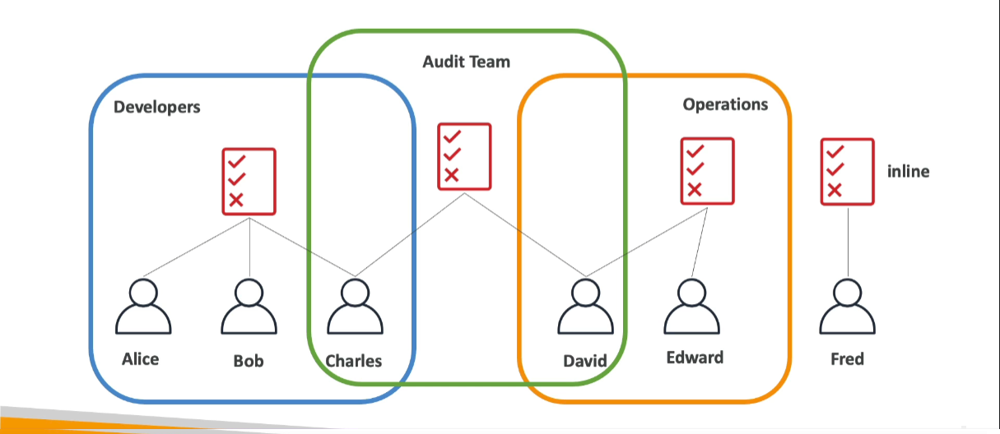
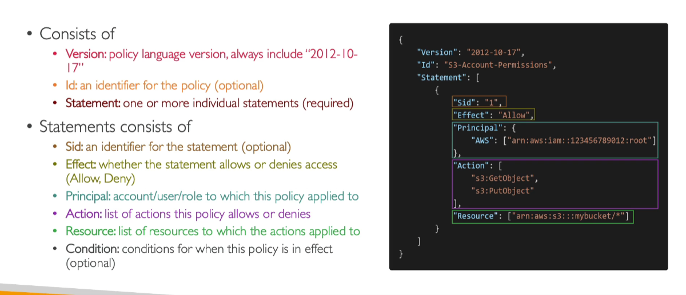
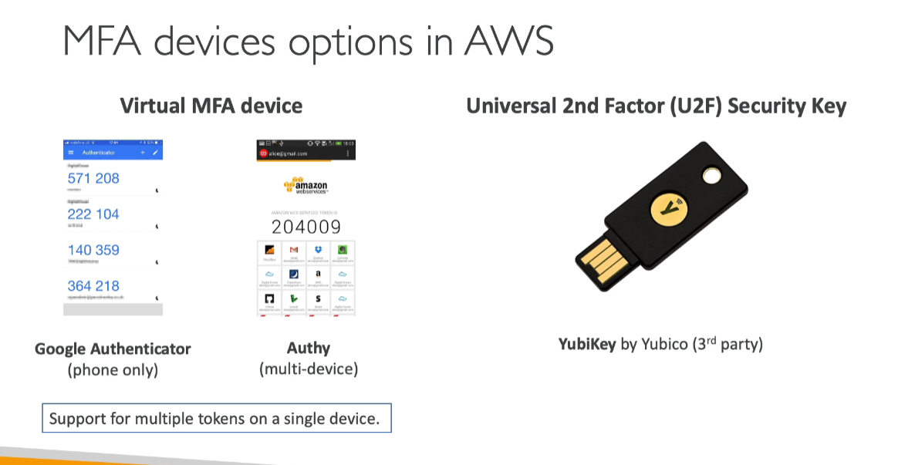
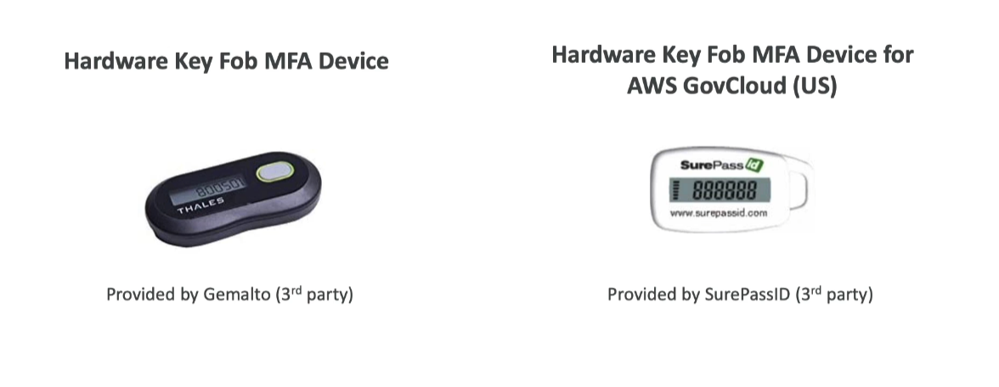
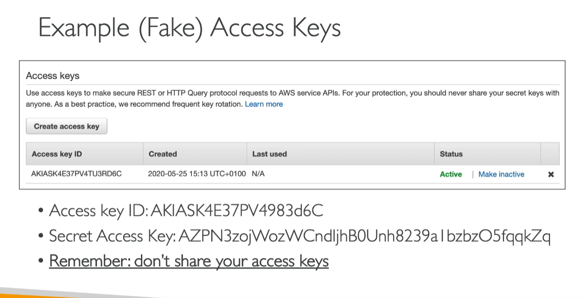
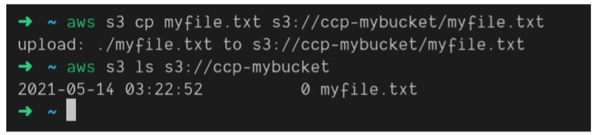
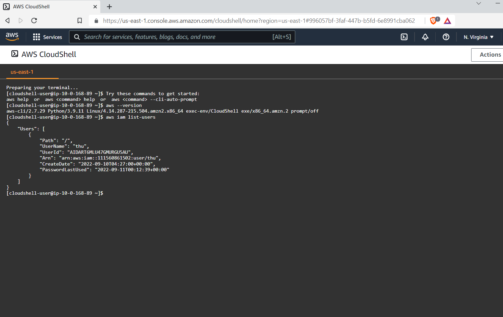
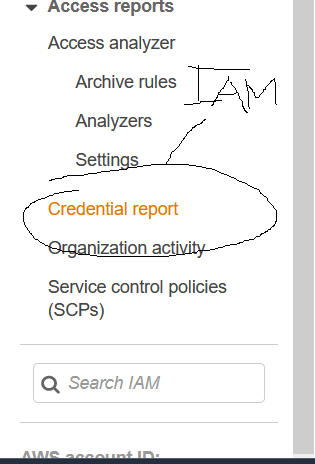

# IAM: Users & Groups

### IAM = Identity and Access Management, Global Service

- Root account created by default, shouldn't be shared or used
- **Users** are people within your organization, and can be grouped
  -user doesn't have to belong to a group, and user can belong to multiple groups
- User groups can't be nested; they can contain only users, not other user groups.

### IAM: Permissions

- **Users or Groups** can be assigned JSON documents called policies
- These poloces define the permissiones of the users
- In AWS you apply the least priviledge principle: don't give more permissions than a user needs
  

### IAM Policies

  

  -Alice, Bob, Charles inherit a specific policy
  - David, Edward inherit a specific policy
  - Fred doesn't belong to any group -> own policy
  - Charles & David: Share same audit policy and each person inherit each team's policy

### IAM Policies Structure

  
Consist of:
<ul>
<li>
Version: policy language version, always include 2012-10-17
</li>
<li>
Id: an identifier for the policy (optional)
</li>
<li>
Statement: one ormore individual statements (required)
<ul>
Statements has:
<li>
Sid: an identifier for the statement (optional)
</li>
<li>
Effect: whether statement allows or denies access (Allow, Deny)
</li>
<li>
Principal: account/user/role to which policy applied to 
</li>
<li>
Action: list of actions this policy allows or denies
</li>
<li>
Resource: list of resources to which the actions applied to
</li>
<li>
Condition: conditions for when this policy is in effect (optional)
</li>
</ul>
</li>

</ul>

### IAM MFA Overview

 <ul>
 <li>
 Strong passwords = higher security for your account

 </li>
 <li>
 In AWS, you can setup a password policy: </li>
 <ul>
 <li>Set a minimum password length</li>
 </li>Require specific character types</li>
 </li>
 <ul>
 <li>uppercase letters</li>
 <li>lowercase letters</li>
 <li>numbers</li>
 <li>non-alphanumeric characters</li>

 </ul>
 </li>
 </ul>
 </li>
 <li>Allow all IAM users to change their own passwords</li>
 <li>Require users to change their password after some time (password expiration)</li>
 <li>Prevent password re-use</li>
 </ul>

 ### Multi Factor Authentication - MFA
 - Users have access to your account and can possibly change configurations or delete sources in your AWS account
 - **You want to protect your Root Accounts and IAM users**
 - MFA = password you know + security device you own

   

- Main benefit of MFA:
*if a password is stolen or hacked, the account is not compromised*

### MFA devices options in AWS

   

   

### How can users access AWS?

- To Access AWS, you have 3 options
<ul>
<ul>
<li> AWS Management Console (protected by password + MFA)
</li>
<li>
AWS Command Line Interface (CLI): protected by access keys
</li>
<li>
AWS Software Developer Kit (SDK): - for code: protected by access keys
</li>

</ul>
</ul>

- Access keys are generated through AWS Console
- Users manage their own access keys
- Access Key are secret, just like a password. Don't share them
- Access Key ID ~= username
- Secret Access key ~= password

### What's the AWS CLI?
- A tool that enables you to interact with AWS services using commands in your command-line shell
- Direct access to the public APIs of AWS services
- You can develop scripts to manage your resources
- It's open-source https://github.com/aws-cli
- Alternative to using AWS Management Console

### What's AWS SDK?
- AWS Software Development Kit (AWS SDK)
- Language-specific APIs (set of libraries)
- Enables you to access and manage AWS services programmatically
- Embedded with your application
- Supports 
  + SDKs (JavaScript, Python, PHP,.NET, Ruby, Java, Go, Nodejs, C++)
  + Mobile SDKs (Android, iOS,...)
  + IOT Device SDKs (Embedded C, Arduino...)
- Exampe: AWS CLI is built on AWS SDK for Python

### AWS Cloud Shell
- A terminal in AWS

### IAM Roles for Services
- Some AWS Service will need to perform actions on your behalf
- To do so, we will assign **permission** to AWS services with IAM roles

- Common roles:
  + EC2 Instance Roles
  + Lambda Function roles
  + Roles for CloudFormation

### IAM Security Tools

- IAM Credentials Report (account-level)
  + A report that lists all your account's users and the status of their various credentials

- IAM Access Advisor (user-level)
  + Access advisor shows the service permissions granted to a user and when those services were last accessed.
  + You can use this information to revise your policies

### IAM Guidlines and Best Practices 

- Don't use the root accout except for AWS account setup
- One physical user = One AWS user
- **Assign users to groups**  and assign permissions groups (to manage at group level)
- Create a **strong password policy**
- Use and enforce the use of Multi Factor Authentication (MFA)
- Create and use Roles for giving permissions to AWS services
- Use Access Keys for Programmatic Access (CLI/SDK)
- Adit permissions of your account with the IAM Credentials Report
- NEVER share IAM users & Access Keys

### IAM Section - Summary

- **Users**: Mapped to a physical user, has a password for AWS Console
- **Groups**: contains users only
- **Policies**: JSON document that outlines permissions for users or groups
- **Roles**: for EC2 intances or AWS services
- **Security**: MFA + Password Policy
- **Access keys**: Access AWS using the CLI or SDK
- **Audit**: IAM Credential Reports & IAM Access Advisor
