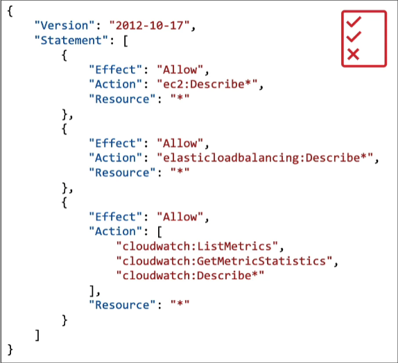

<!-- TABLE OF CONTENTS -->

  
Table of Contents

  <ol>
    <li>
      <a href="#What's-AWS">Introduction - AWS Certified Solutions Architect Associate</a>
    </li>
     <li>
      <a href="#IAM:-Users-&-Groups">IAM & AWS CLI</a>
    </li>
    <li>
      <a href="#">EC2 Fundamentals</a>
    </li>
     <li>
      <a href="#">EC2 - Solutions Architect Associate Level</a>
    </li>
     <li>
      <a href="#">EC2 Instance Storage</a>
    </li>
     <li>
      <a href="#">High availability and Scalability</a>
    </li>
     <li>
      <a href="#">AWS Fundamentals: RDS + Aurora + ElastiCache</a>
    </li>
     <li>
      <a href="#">Route 53</a>
    </li>
     <li>
      <a href="#">Classic Solutions Architect Discussions</a>
    </li>
     <li>
      <a href="#">Amazon S3 Introduction</a>
    </li>
     <li>
      <a href="#">AWS SDK, IAM Roles & Policies</a>
    </li>
    <li>
      <a href="#">Advanced Amazon S3</a>
    </li>
    <li>
      <a href="#">CloudFront & AWS Global Accelerator</a>
    </li>
       <li>
      <a href="#">AWS Storage Extras</a>
    </li>
  </ol>

# What's AWS?

- AWS (Amazon Web Services) is a Cloud Provider
- Provide you with servers and services that you can use **on demand** and **scale easily**
- AWS powers some of the biggest websites in the world

## AWS Cloud Use Cases

1.  AWS enables you to build sophisticated, scalable applications
2.  Applicable to a diverse set of industries
3.  Use cases include:

- Enterprises IT, Backup & Storage, Big Data analytics
- Website hosting, Mobile & Social Apps
- Gaming

## AWS Global Infrastructure

<ol>
  <li>
  
 AWS Regions

  <ul>
  <li>All around the world</li>
    <li>A region is a cluster of data centers</li>
    <li>How to choose an AWS Region?</li>
    <ul>
    <li>
    Compliance with data governance and lega requirementsL region
    </li>
    <li>Proxmity to customers: ex Customer are in US -> choose US region. Reduce lags</li>
     <li>Available services within a Region: New servuces and new features aren't available in every Region</li>
      <li>Pricing: varies region to region and is transparen in the service pricing page</li>
    </ul>
  </ul>
  </li>
  <li>
AWS Availability Zones

   <ul>
   <li>Each region has many availability zones ( usually 3, min is 2, max is 6). ex: ap-southeast-2a, ap-southeast-2b, ap-southeast-2c</li>
   <li>Each availability zone (AZ) is one or more discrete data centers with redundant power, networking, and connectivity </li>
   <li>They're seperate from each other, so that they're isolated from disasters</li>
   <li>Connected with high bandwidth, ultra-low latency networking</li>
  
   </ul>  
  </li>
  <li>AWS Data Centers</li>
  <li>AWS Edge Locations / Points of Presence
  <ul>
  <li>Amazon has 216 Points of Presence (205 Edge Locations & 11 Regional Cache) in 84 cities accross 42 countries</li>
   <li>Content is delivered to end user with lower latency</li>
  </ul>
  </li>
  <li>Tour of the AWS Console
  <ul>
  <li>AWS has Global Services
  <ul>
  <li>Identity and Access Management (IAM)</li>
   <li>Route 53 (DNS service)</li>
    <li>CloudFront (Conten Delivery Network)</li>
    <li>WAF (Web Application Firewall)</li>
  </ul>
  </li>
  <li>Most AWS services are Region-scoped:
  <ul>
  <li>Amazon EC2 (Infrastructure as a Service)</li>
   <li>Elastic Beanstalk (Platform as a Service)</li>
    <li>Lambda (Function as a Service)</li>
    <li>Rekonigtion (Software as a Service)</li>
  </ul>
  </ul>
  </li>
</ol>

# IAM: Users & Groups

### IAM = Identity and Access Management, Global Service

- Root account created by default, shouldn't be shared or used
- **Users** are people within your organization, and can be grouped
-Groups dob't have to belong a grup, and user can belong to multiple groups

## IAM: Permissions
- **Users or Groups** can be assigned JSON documents called policies
- These poloces define the permissiones of the users
- In AWS you apply the least priviledge principle: don't give more permissions than a user needs

